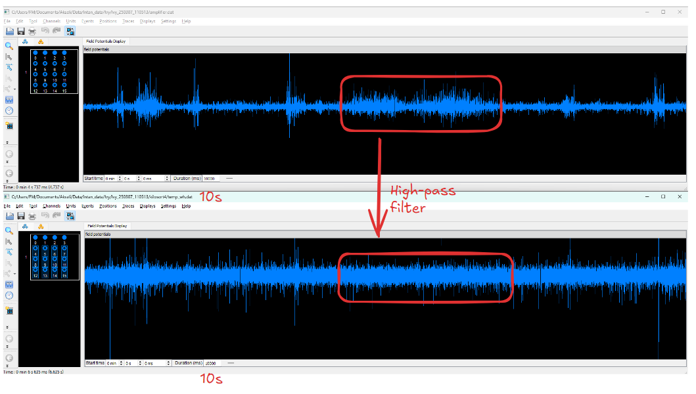

Tags:  <br>
- 📚 [Kilosort4 — Kilosort4 0.0.1 documentation](https://kilosort.readthedocs.io/en/latest/index.html) (also helpful discussion on parameters: [here](https://kilosort.readthedocs.io/en/latest/parameters.html))<br>
- YouTube Video: [2023 2 01 Kilosort (Pachitariu)](https://www.youtube.com/watch?v=LTSmoACr918)<br>
<br>
Obsidian:  ,  ,  ,  ,  ,  <br>
<br>
<br>
<br><br>
### Install instructions<br>
<br>
1. Clone Github Repo<br>
2. Follow appropriate ReadMe instructions, <br>
	1. Install an [Anaconda](https://www.anaconda.com/products/distribution) distribution of Python. Note you might need to use an anaconda prompt if you did not add anaconda to the path.<br>
	2. Open an anaconda prompt / command prompt which has `conda` for **python 3** in the path<br>
	3. Create a new environment with `conda create --name kilosort python=3.9`. Python 3.10 should work as well.<br>
	4. To activate this new environment, run `conda activate kilosort`<br>
	5. To install kilosort and the GUI, run `python -m pip install kilosort[gui]`<br>
	7. Next, if the CPU version of pytorch was installed (will happen on Windows), remove it with `pip uninstall torch`<br>
	8. Then install the GPU version of pytorch `conda install pytorch pytorch-cuda=11.8 -c pytorch -c nvidia`<br>
<br>
3. If Cuda, nvidia drivers not installed yet:<br>
<br>
	If step 8 does not work, you need to make sure the NVIDIA driver for your GPU is installed (available [here](https://www.nvidia.com/Download/index.aspx?lang=en-us)). You may also need to install the CUDA libraries for it, we recommend [CUDA 11.8](https://developer.nvidia.com/cuda-11-8-0-download-archive).<br>
	<br>
	If pytorch installation still fails, follow the instructions [here](https://pytorch.org/get-started/locally/) to determine what version of pytorch to install. The Anaconda install is strongly recommended on Windows, and then choose the CUDA version that is supported by your GPU (newer GPUs may need newer CUDA versions > 10.2). For instance this command will install the 11.8 version on Linux and Windows (note the `torchvision` and `torchaudio` commands are removed because kilosort doesn't require them):<br>
	<br>
	`conda install pytorch pytorch-cuda=11.8 pynvml -c pytorch -c nvidia`<br>
	<br>
	This [video](https://www.youtube.com/watch?v=gsixIQYvj3U) has step-by-step installation instructions for NVIDIA drivers and pytorch in Windows (ignore the environment creation step with the .yml file, we have an environment already, to activate it use `conda activate kilosort`).<br>
<br>
<br>
4. Add missing packages `pip install ipykernel pandas`<br>
<br>
5. Then downgrade numpy to be below 2.0.0 ([NumPy 2.0 compatibility · Issue #722 · MouseLand/Kilosort](https://github.com/MouseLand/Kilosort/issues/722)), `pip install --upgrade numpy<"2.0.0"`<br>
<br>
<br><br>
### Pre-processing in kilosort<br>
<br>
<br>
- ❓ kilosort code `artifact_threshold` $$\rightarrow$$ meaning?<br>
<br>
<br>
| Step | Name                               | Purpose                                                                                                                               | Obsidian backlinks                                                                            |<br>
| ---- | ---------------------------------- | ------------------------------------------------------------------------------------------------------------------------------------- | --------------------------------------------------------------------------------------------- |<br>
| 1    | Subtract mean                      | Remove the mean across time for each batch (2s)                                                                                       |                                                                                               |<br>
| 2    | Common average referencing (CAR)   | Subtract at each timepoint the median of the signal across all chanels                                                                |                                                                                               |<br>
| 3    | Temporal filtering                 | Something similar to butterworth high-pass fitler (cutoff = 300Hz), but done in frequency domain, see `fft_highpass` as faster on GPU |  ,   |<br>
| 4    | Channel whitening / Spatial filter | Remove correlations across channels, e.g. spikes from 100–1,000 μm away from the probe $$\rightarrow$$ done for nearest 32 channels     | Akseli docs:, separate doc:                                       |<br>
| 5    | Drift correction                   | ...                                                                                                                                   |                                                                                               |<br>
<br>
<br>
<br>
<br>
<br>
<br>
<br>
<br>
- Top: Original data: `amplifier.dat`, Bottom: `temp_wh.dat` (pre-processed raw data)<br>
- ⚠️ in `C:\Users\FM\Documents\Akseli\Code\kilosort_pipeline\kilosort_plots.ipynb`, there is code with which you can save the pre-processed raw data, and then display in Neuroscope as done here<br>
<br>
<br><br>
### Output files of `run_kilosort`<br>
<br>
- 📚 Text (partially) taken from documentation in ``Kilosort\kilosort\io.py``<br>
- The following files (and some others not used in tutorial) will be saved in `results_dir`<br>
<br>
<br><br>
<br><br>
### Meta data: `ops`<br>
<br>
ops.npy : shape N/A<br>
	`ops`<br>
	Dictionary containing a number of state variables saved throughout<br>
	the sorting process (see `run_kilosort`). We recommend loading with<br>
	`kilosort.io.load_ops`.<br>
<br>
<br>
<br><br>
<br><br>
### Channel map<br>
<br>
channel_map.npy : shape (n_channels,)<br>
	`chan_map`<br>
	Same as probe['chanMap']. Integer indices into rows of binary file<br>
	that map the data to the contacts listed in the probe file.<br>
<br>
<br><br>
<br><br>
### Spike Times<br>
spike_times.npy : shape (n_spikes,)<br>
	`st`<br>
	Sample index of the waveform peak for each spike.<br>
<br>
<br>
<br><br>
<br><br>
### Templates vs clusters<br>
- 📚 See in `def save_to_phy` (in `io.py`) Note that 'template' here does not refer to the universal or learned templates used for spike detection, as it did in some past versions of Kilosort. Instead, it refers to the average spike waveform (after whitening, filtering, and drift correction) for all spikes assigned to each cluster, which are template-like in shape. We use the term 'template' anyway for this section because that is how they are treated in Phy. Elsewhere in the Kilosort4 code, we would refer to these as 'clusters.'<br>
<br>
<br>
<br>
<br>
<br>
| variable in kilosort | filename saved for phy          | variable in phy                      | Plot above | Shape                         |<br>
| -------------------- | ------------------------------- | ------------------------------------ | ---------- | ----------------------------- |<br>
| spike_clusters       | 'spike_templates.npy'           | spike_templates/spike_clusters       | right      | (n_spikes,)                   |<br>
| spike_clusters       | 'spike_clusters.npy'            | spike_templates/spike_clusters       | right      | (n_spikes,)                   |<br>
| spike_templates      | 'spike_detection_templates.npy' |                                      | right?     | ???                           |<br>
| templates            | 'templates.npy'                 | ``Bunch(data)`` in `class TraceView` | left?      | (n_templates, nt, n_channels) |<br>
<br>
<br>
spike_clusters.npy : shape (n_spikes,)<br>
	`clu`<br>
	For each spike, integer indicating which template it was assigned to.<br>
- ❌ spike_clusters & spike_templates are the same $$\rightarrow$$ see  <br>
<br>
<br>
templates.npy : shape (n_templates, nt, n_channels $$\rightarrow$$  $$i, t, j$$)<br>
	Full time x channels template shapes.<br>
	- e.g. (n_templates, nt, n_channels) = (396, 62, 384)<br>
		- where nt = number of time points in each template (template length: $$5ms$$)<br>
<br>
<br>
<br>
<br>
- example of 3 different templates, for all nt (x-axis) and all channels (colours)<br>
<br>
<br>
- ⚠️ `Templates (n_templates, nt, n_channels)` are averaged waveforms (over $$5ms$$ with 60 nt) for all the neurons detected within the same cluster. <br>
<br>
<br>
<br><br>
<br><br>
### Chan best<br>
<br>
<br>
- `chan_best` is a list indexed by `n_templates` that for each template describes which channel has the most representative sum of detected waveforms similar to the template waveform<br>
- ❓ `chan_best = chan_map[chan_best]`<br>
<br>
`chan_best`<br>
- shape (n_templates) <br>
<br>
```python<br>
templates =  np.load(results_dir / 'templates.npy')<br>
chan_best = (templates**2).sum(axis=1).argmax(axis=-1)<br>
```<br>
- $$i$$ - templates, $$t$$ - time points <br>
- `.sum(axis=1)` $$\rightarrow$$ summing over time points (axis=1)<br>
<br>
<br>
$$\text{sum\_squared}[i,j] = \sum_{t=1}^{62} (\text{templates}[i,t,j])^2 <br>
$$<br>
<br>
- Then apply `.argmax(axis=-1)` $$\rightarrow$$ index of the maximum value along **`axis=-1`**, which corresponds to the channels $$j$$ <br>
<br>
$$\text{chan\_best}[i]=\text{argmax}​(\text{sum\_squared}[i,j])<br>
$$<br>
<br>
<br>
<br>
<br>
<br>
<br>
<br>
- ⚠️ `clu` is an integer indicating, for each spike, which template the spike is assigned to. By passing `chan_best[clu]`, we get the channel number for each spike, since it's most likely that the spike originated from the channel where its associated template is most likely. <br>
<br>
<br>
<br>
<br>
<br>
<br>
<br>
<br>
<br>
<br>
<br><br>
<br><br>
### Firing rate activity<br>
<br>
spike_clusters.npy : shape (n_spikes,)<br>
	`clu`<br>
	For each spike, integer indicating which template it was assigned to.<br>
<br>
<br>
```python<br>
clu = np.load(results_dir / 'spike_clusters.npy')<br>
firing_rates = np.unique(clu, return_counts=True)[1] * 30000 / st.max()<br>
```<br>
<br>
- ⚠️ $$\text{firing\_rate} = \frac{\text{spike count}}{T} \times f_{s}$$ <br>
- ( )<br>
<br>
```python<br>
unique_elements, counts = np.unique([1, 2, 2, 2, 4, 4], return_counts=True)<br>
# Output<br>
Unique elements: [1 2 4]<br>
Counts: [1 3 2]<br>
```<br>
<br>
`clu`: shape(n_spikes) $$\rightarrow$$ ``firing_rates``: shape(n_templates)<br>
<br>
<br>
<br>
<br><br>
<br><br>
### Amplitude<br>
amplitudes.npy : shape (n_spikes,)<br>
	`amplitudes`<br>
	Per-spike amplitudes, computed as the L2 norm of the PC features<br>
	for each spike.<br>
<br>
cluster_Amplitude.tsv : shape (n_templates,)<br>
	`camps`<br>
	Per-template amplitudes, computed as the L2 norm of the template.<br>
<br>
- ❓ no access to the voltage amplitude???<br>
<br>
<br>
<br><br>
<br><br>
### Spike positions<br>
<br>
#todo <br>
- [ ] understand further<br>
<br>
spike_position.npy : shape (n_spikes,2)<br>
- ,2 $$\rightarrow$$ xy position $$\rightarrow$$ in Margot code then saved for each `clu` as separate `PosX`, `PosY`<br>
 <br>
<br>
- 📚 `C:\Users\FM\anaconda3\envs\kilosort\Lib\site-packages\kilosort\postprocessing.py`: <br>
<br>
<br>
<br>
<br>
<br>
<br><br>
<br><br>
### Contamination percentage: MUA vs Good units <br>
<br>
cluster_ContamPct.tsv : shape (n_clusters,)<br>
	`contam_pct`<br>
	"Contamination rate for each template, computed as fraction of refractory<br>
	period violations relative to expectation based on a Poisson process."<br>
<br>
<br>
<br>
<br>
<br>
|                   | Criterion 1                                                                                            | Criterion 2                                                                                                           |<br>
| ----------------- | ------------------------------------------------------------------------------------------------------ | --------------------------------------------------------------------------------------------------------------------- |<br>
| **Description**   | ratio of refractory coincidences ($$n_k$$) versus coincidences in other bins (e.g. "shoulders")          | probability $$P_k$$ that $$n_k$$ spikes or less would be observed from a Poisson process with rate $$\lambda_{k}= (2k+1)R$$ |<br>
| **Limitation**    | if firing rate of unit is low $$\rightarrow$$ few refractory coincidences may be observed just by chance |                                                                                                                       |<br>
| **Criteria**      | $$Q_{12}$$ $$\rightarrow  \min(\frac{Q_i}{\text{min}(\text{Q00}, \text{Q01})})$$                           | $$R_{12}$$ $$\rightarrow \min(P_k)$$ for different windows                                                                |<br>
| **ACG threshold** | $$Q_{12} < 0.2$$                                                                                         | $$R_{12} < 0.2$$                                                                                                        |<br>
| **CCG threshold** | $$Q_{12} < 0.25$$                                                                                        | $$R_{12} < 0.05$$                                                                                                       |<br>
<br>
<br>
<br>
- ❌ $$Q_{12}, R_{12}$$ in our current kilosort version were mixed up in terms of variable names $$\rightarrow$$ in a new issue they will update this<br>
- ❓ Later double check whether still $$Q$$ corresponds to criterion 1, and $$R$$ corresponds to criterion 2<br>
<br>
<br>
- 📚 The different thresholds for ACG and CCG have to do with the function of these decisions: for the ACG, we want small contamination rates $$R_{12}$$ because this indicates a well-isolated neuron, whereas for the CCG we want to prevent clusters from being split if their contamination rate $$R_{12}$$ is indicative of a relationship between these two clusters. This is similar for $$Q12$$<br>
<br>
<br>
- ⚠️ For computing the CCG, ACG $$\rightarrow$$ Bin size =1ms, window ($$\delta t$$) = $$\pm 0.5s$$<br>
- 📚 Code from: `"C:\Users\FM\anaconda3\envs\kilosort\Lib\site-packages\kilosort\CCG.py"`<br>
<br>
<br>
<br>
<br>
<br>
<br>
<br>
<br><br>
<br><br>
### Principal components <br>
<br>
- `pc_features` $$\rightarrow$$ shape(n_spikes, n_pcs, nearest_chans)<br>
	- pc_features.npy<br>
	- Tensor of pc features as returned by `template_matching.extract`,<br>
	- ❌ Earlier in kilosort code the shape of `tF` is `(n_spikes, nearest_chans, n_pcs)`, but later they swap the last 2 dimensions as Phy expects this ordering<br>
- `pc_features_ind` $$\rightarrow$$ shape(n_clusters, nearest_chans)<br>
	- pc_features_ind.npy<br>
	- Channel indices associated with the data present in tF for each cluster<br>
<br>
- ❓ weird that they adjust shape of `tF` $$\rightarrow$$ in `class FeatureView` in `phy\cluster\views\feature.py`, they define shape of Bunch(data) as `(n_spikes, n_channels, n_features)`, and use that for constructing the FeatureView plots