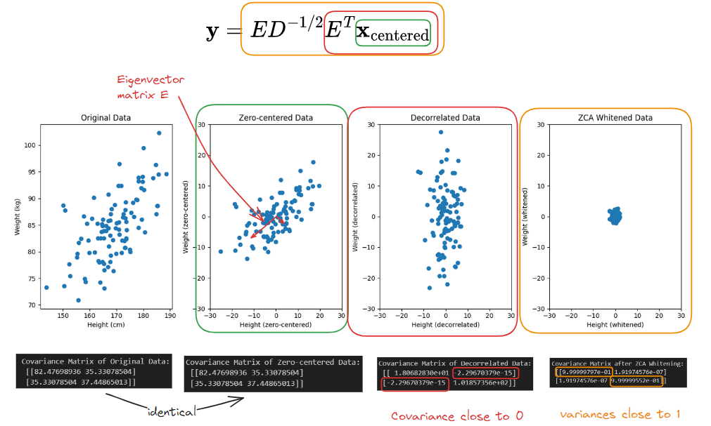

Tags:  ,  ,  ,  <br>
<br>
<br><br>
### ZCA whitening matrix.<br>
<br>
Steps:<br>
1. Zero-center data (Divide by mean $$\mathbf{\bar{x}}$$)<br>
<br>
$$\mathbf{x}_\text{centered} = \mathbf{x} - \bar{\mathbf{x}}<br>
$$<br>
<br>
2. Decorrelate data:<br>
<br>
$$\mathbf{x}_\text{decorrelated} = E^T \mathbf{x}_\text{centered}<br>
$$<br>
<br>
<br>
3. Create ZCA Whitening matrix:<br>
<br>
$$W_{\text{ZCA}} = E D^{-1/2} E^T<br>
$$<br>
<br>
<br>
4. Apply Whitening matrix: (Matrix multiplication)<br>
<br>
$$\mathbf{y} = W_{ZCA} \mathbf{x}_\text{centered}<br>
$$<br>
<br>
<br>
<br>
where:<br>
- $$\mathbf{x}$$ is data<br>
- $$E$$ is matrix of eigenvectors of original $$\mathbf{x}$$<br>
- $$D^{-1/2}$$ is the diagonal matrix of the inverse square roots of the eigenvalues<br>
- $$W_{ZCA}$$ is the whitening matrix<br>
<br>
- ❌ Note how, step 2 can be skipped, since ZCA implicitly does decorrelation + sphering in one step<br>
<br>
<br>
<br>
<br>
<br>
<br>
- bottom:  <br>
- ⚠️ Note during decorrelation step, covariance $$\rightarrow$$ 0 (implicit in definition of  ) and during ZCA whitening step $$\rightarrow$$ variance of each diagonal equals 1<br>
<br>
<br>
<br><br>
### Kilosort implementation<br>
<br>
`wrot` $$\rightarrow$$ $$W_{\text{ZCA}}$$<br>
<br>
- ⚠️ A separate whitening vector (`wrot`) is estimated for each channel based on its nearest 32 channels $$\rightarrow$$ for 16ch all our channels<br>
<br>
```python<br>
def whitening_from_covariance(CC):<br>
    """Whitening matrix for a covariance matrix CC.<br>
    This is the so-called ZCA whitening matrix.<br>
<br>
    """<br>
    E,D,V =  torch.linalg.svd(CC)<br>
    eps = 1e-6<br>
    Wrot =(E / (D+eps)**.5) @ E.T<br>
    return Wrot<br>
<br>
```<br>
<br>
<br>
<br>
<br><br>
### For me<br>
<br>
#todo <br>
- [ ]   understand relationship between eigenvector and change of basis and and dot product<br>
<br>
<br>
