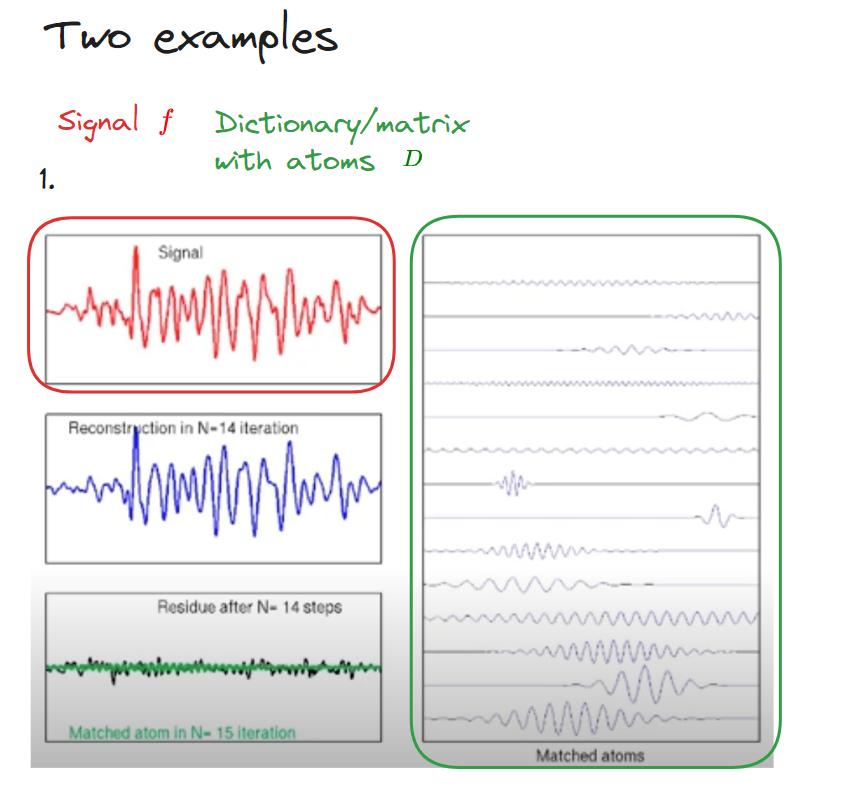
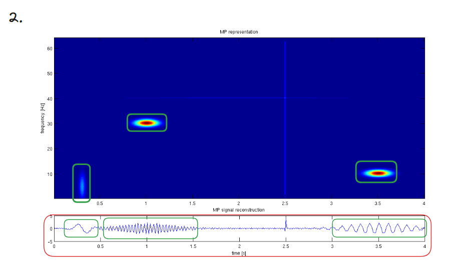

Tags: [[2024-09-17 Kilosort4]], 
- 📚 1993, Mallat and Zhang, [Matching pursuit - Wikipedia](https://en.wikipedia.org/wiki/Matching_pursuit)
- 📚 Good youtube video: https://www.youtube.com/watch?v=RFo068s8_jU

- ⚠️ The basic idea is to approximately represent a signal $$f$$ from Hilbert space $$H$$ as a weighted sum of finitely many functions $$g_{\gamma _{n}}$$ taken from $$D$$. An approximation with $$N$$ atoms has the form: 
$$f(t)\approx {\hat {f}}_{N}(t):=\sum _{n=1}^{N}a_{n}g_{\gamma _{n}}(t)
$$
 where $$g_{\gamma _{n}}$$ is $$\gamma_{n}$$ column of the matrix $$D$$ and an $$a_{n}$$ is the scalar weighting factor (amplitude) for the atom $$g_{\gamma_{n}}$$! $$D$$ for dictionary.

- ❌ Iterating over all vectors in $$D$$ would take too long (computationally expensive)
- ✅ Solution: The idea between the **matching pursuit** algorithm is to a find a **greedy** solution. This solution is to first find **1 atom** that minimizes the approximation error between the signal and the approximation ($$\min _{x}\|f-Dx\|_{2}^{2}$$). Achieved by taking the atom $$g_{\gamma_{n}}$$ that has the highest inner product with $$f$$. (Two vectors are very similar if their inner product is high - see [[2024-09-30 Inner product space]]). This step is repeated to find the next best atom $$g_{\gamma_{n}}$$, and so on. All atoms are weighted by $$a_{n}$$.

