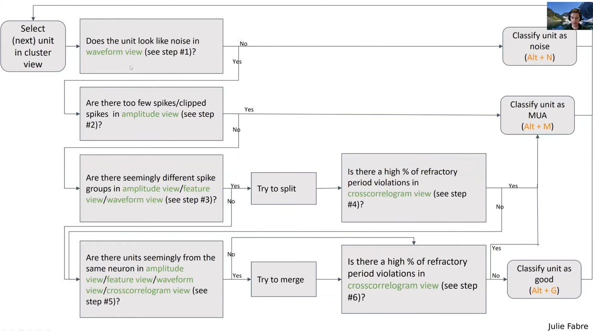
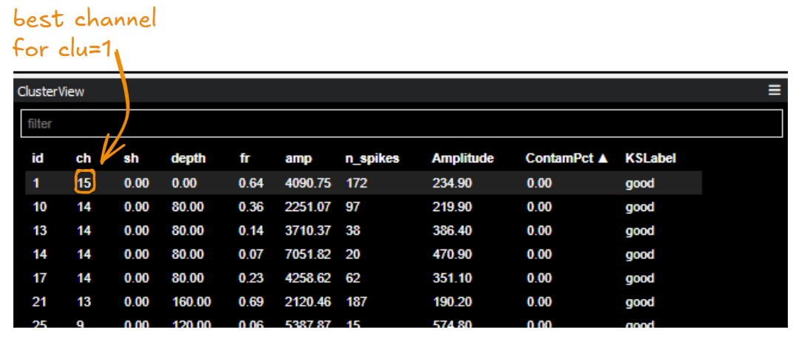
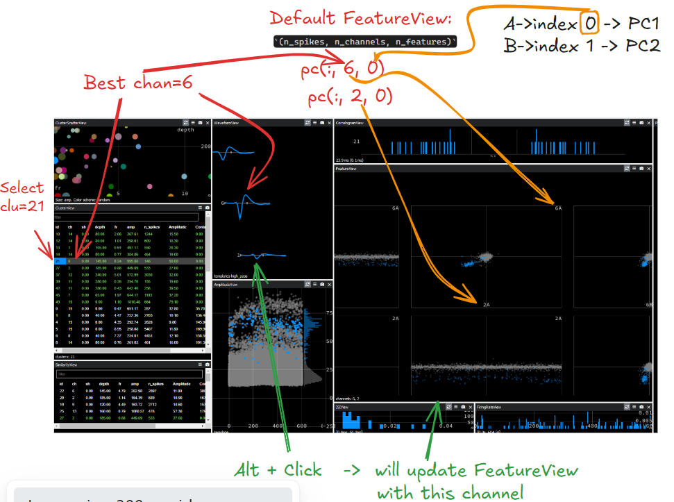
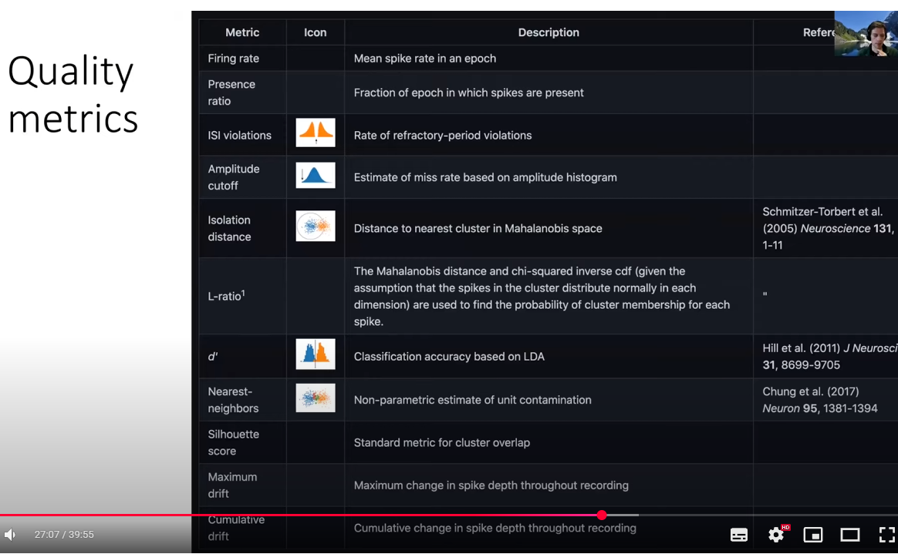
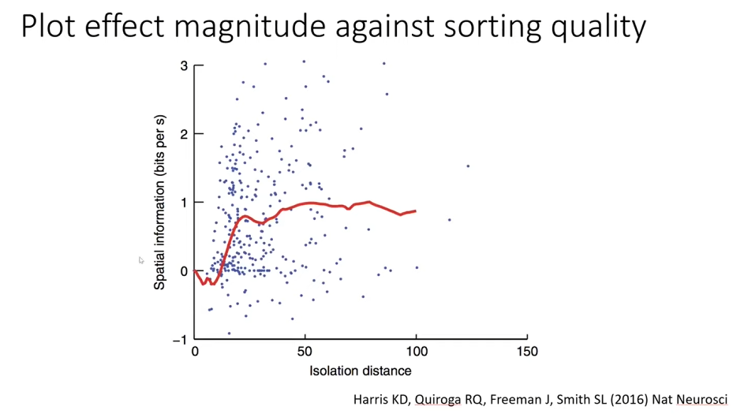

---<br>
title: 2025-01-24 Phy Gui<br>
layout: default <br>
mathjax: true<br>
mathjax: true<br>
tags: #conceptual<br>
---<br>
Tags:  ,  <br>
- 📚 Documentation: https://phy.readthedocs.io/en/latest/<br>
- 📚 `C:\Users\FM\anaconda3\envs\phy2\Lib\site-packages\phy`<br>
- 📚 [2021 Lecture 2.4 - Curating sorted spikes with Phy - Nick Steinmetz (UW) - YouTube](https://www.youtube.com/watch?v=czdwIr-v5Yc)<br>
<br><br>
<br><br>
###  Workflow<br>
<br>
- ⚠️ See typical workflow in https://phy.readthedocs.io/en/latest/sorting_user_guide/#a-typical-approach-to-manual-clustering<br>
<br>
<br>
<br>
<br>
<br><br>
<br><br>
### Best channel(s!) & Templates<br>
<br>
<br>
<br>
Order:<br>
1. `get_template_for_cluster` $$\rightarrow$$ most frequent template for cluster<br>
2. `get_best_channels` $$\rightarrow$$ Return the list of best channels for any given cluster, sorted by decreasing match.<br>
3. `best_channel` $$\rightarrow$$ `get_best_channels(cluster_id)[0]` $$\rightarrow$$ get first channel returned by `get_best_channels()<br>
<br>
<br>
<br>
<br>
| KS export file        | Phy variable (code below) | Shape        | Status          |<br>
| --------------------- | ------------------------- | ------------ | --------------- |<br>
| `spike_clusters.npy`  | ``spikes_per_cluster``    | (n_spikes, ) | changes         |<br>
| `spike_templates.npy` | ``spike_templates``       | (n_spikes, ) | does not change |<br>
-<br>
<br>
<br>
<br>
- ❌ Initially, before running phy, the ``spike-cluster`` and ``spike-template`` assignments are identical. If ``spike_clusters.npy`` does not exist, it is automatically copied from ``spike_templates.npy``. When modifying the spike-cluster assignments in phy, only ``spike_clusters.npy`` is modified, while ``spike_templates.npy`` remains unchanged.<br>
- ⚠️ E.g. if we merge two clusters, then ``spike_clusters.npy`` would merge, whilst ``spike_templates.npy`` would be unchanged<br>
<br>
```python<br>
def get_template_for_cluster(self, cluster_id): <br>
"""Return the largest template associated to a cluster.""" <br>
# st -> template_ids for all spikes in this cluster_id<br>
spike_ids = self.supervisor.clustering.spikes_per_cluster[cluster_id] <br>
st = self.model.spike_templates[spike_ids] <br>
# Find the template id that appears most frequently (highest count)<br>
template_ids, counts = np.unique(st, return_counts=True) <br>
ind = np.argmax(counts) <br>
return template_ids[ind],<br>
```<br>
- ❌ although it says "return largest template" $$\rightarrow$$ essentially what it does is **Return the template id that appears most frequently.** <br>
<br>
<br>
```python<br>
    def get_best_channels(self, cluster_id):<br>
        """Return the best channels of a given cluster."""<br>
        template_id = self.get_template_for_cluster(cluster_id)<br>
        template = self.model.get_template(template_id)<br>
        if not template:  # pragma: no cover<br>
            return [0]<br>
        return template.channel_ids<br>
```<br>
- ⚠️ Uses `get_template_for_cluster` to get template_id $$\rightarrow$$ get template (shape: `(n_samples, n_channels)`) for this `cluster_id` $$\rightarrow$$ template involves **multiple channels**<br>
<br>
<br>
- ❓ How does phy compute the template?<br>
``get_template(template_id)`` $$\rightarrow$$ ``int => Bunch(template, channel_ids)``<br>
- ⚠️ Return the template data as a `(n_samples, n_channels)` array, the corresponding channel ids of the template.<br>
- ❓ Possibly, related to KS functions: <br>
1. Load ``templates.npy`` (from KS), with shape: `(n_templates, nt, n_channels)`<br>
2. Average across templates $$\rightarrow$$ ``templates.mean(axis=0)`` $$\rightarrow$$ shape `(n_samples, n_channels)` <br>
	- ⚠️ see also: `_get_mean_waveforms` in `base.py` & ``toggle_mean_waveforms`` shortcut: press `m` in `wave_form view`<br>
<br>
<br>
<br><br>
<br><br>
### SimilarityView<br>
<br>
- ⚠️ Based on KS  ``similar_templates.npy`` : shape (n_templates, n_templates)<br>
- Similarity score between each pair of templates, computed as correlation between templates.<br>
<br>
<br><br>
<br><br>
### Feature view<br>
<br>
- ❓ Data should come from `pc_features.npy`?<br>
<br>
- Coloured spikes from selected clusters<br>
- Background spikes from all clusters are shown in grey.<br>
<br>
- ❓ `pc_features.npy` $$\rightarrow$$ captured by Bunch(data), shape: `(n_spikes, n_channels, n_features)`<br>
- 📚 See Bunch and visualizations functions in  `class FeatureView` in `phy\cluster\views\feature.py`<br>
<br>
<br>
<br>
<br>
- ⚠️ By default, the two clusters chosen for PCs in FeatureView will be determined by  `def get_best_channels`, but then you can manually change this by `Alt + Click` in Waveform View<br>
<br>
<br>
<br>
<br>
- Plots are mirrored across diagonal, so we can ignore bottom half<br>
<br>
<br><br>
<br><br>
### Template features<br>
- ❓ Is this related to FeatureView??<br>
<br>
- 📚 See discussion on types of amplitudes in Phy [here](https://phy.readthedocs.io/en/latest/terminology/#amplitude), $$\rightarrow$$ **Template amplitude:** for every template, the **maximum amplitude** of the template waveforms across all channels.<br>
<br>
<br>
<br>
```python<br>
    def get_spike_template_features(self, spike_ids, first_cluster=None, **kwargs):<br>
		"""Return the template features of the requested spikes onto the <br>
        first selected cluster.<br>
<br>
        This is "the dot product (projection) of each spike waveform onto <br>
        the template of the first cluster."<br>
<br>
        See @mswallac's comment at<br>
        https://github.com/cortex-lab/phy/issues/868#issuecomment-520032905<br>
        """<br>
        assert first_cluster >= 0<br>
        tf = self.model.get_template_features(spike_ids)<br>
        if tf is None:<br>
            return<br>
        template = self.get_template_for_cluster(first_cluster)<br>
        template_amplitudes = tf[:, template]<br>
        assert template_amplitudes.shape == spike_ids.shape<br>
        return template_amplitudes<br>
```<br>
<br>
<br>
```python<br>
    def _get_template_features(self, cluster_ids, load_all=False):<br>
        """Get the template features of a pair of clusters."""<br>
        if len(cluster_ids) != 2:<br>
            return<br>
        assert len(cluster_ids) == 2<br>
        clu0, clu1 = cluster_ids<br>
<br>
        s0 = self._get_feature_view_spike_ids(clu0, load_all=load_all)<br>
        s1 = self._get_feature_view_spike_ids(clu1, load_all=load_all)<br>
<br>
        n0 = self.get_template_counts(clu0)<br>
        n1 = self.get_template_counts(clu1)<br>
<br>
        t0 = self.model.get_template_features(s0)<br>
        t1 = self.model.get_template_features(s1)<br>
<br>
        x0 = np.average(t0, weights=n0, axis=1)<br>
        y0 = np.average(t0, weights=n1, axis=1)<br>
<br>
        x1 = np.average(t1, weights=n0, axis=1)<br>
        y1 = np.average(t1, weights=n1, axis=1)<br>
<br>
        return [<br>
            Bunch(x=x0, y=y0, spike_ids=s0),<br>
            Bunch(x=x1, y=y1, spike_ids=s1),<br>
        ]<br>
```<br>
<br>
<br>
<br>
<br>
<br>
<br><br>
<br><br>
### Correlogram<br>
<br>
<br>
<br>
<br><br>
<br><br>
### Quality metrics <br>
#todo <br>
- [ ] explore later<br>
<br>
<br>
- ⚠️ allen institute has **code** for good quality metrics of spikes <br>
<br>
<br>
<br>
- ⚠️ y-axis (effect i am intererested in), x-axis (spike sorting quality metric)<br>
<br>
