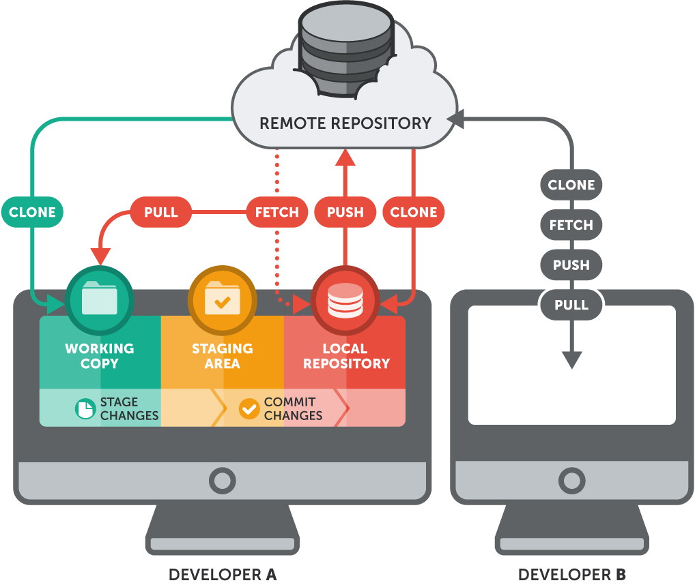
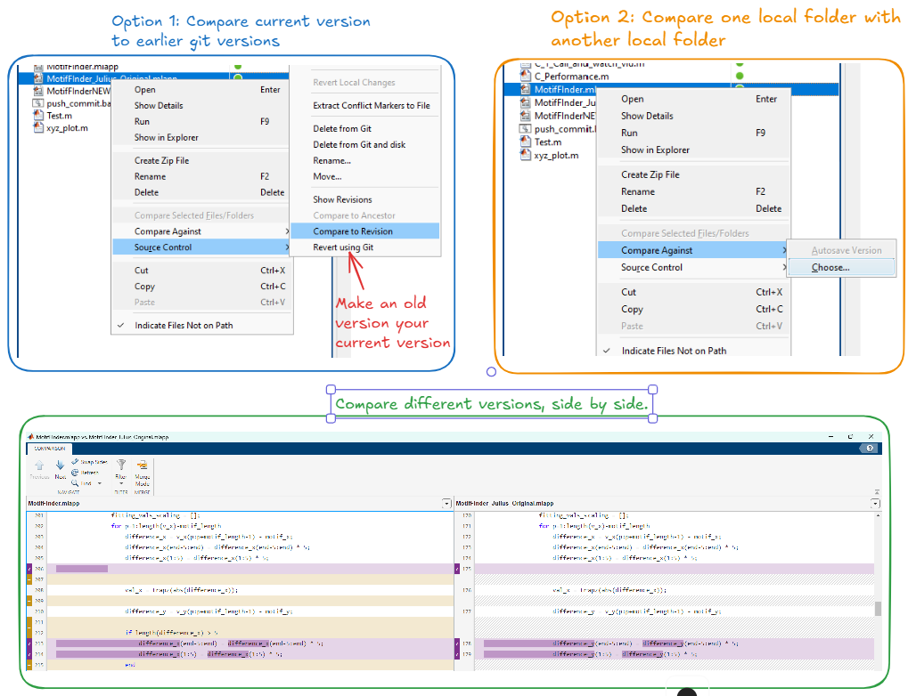

---<br>
title: 2025-02-03 Using GitHub with Matlab<br>
layout: default <br>
mathjax: true<br>
tags: #project<br>
---<br>
Tags:  <br>
<br>
<br>
<br>
<br>
<br><br>
### Set up github repository from folder<br>
<br>
-  `cd` to folder which you would like to upload to github<br>
```cmd<br>
cd C:\Akseli\Pipeline<br>
```<br>
<br>
<br>
 - Initialize the repo<br>
```git<br>
git init<br>
```<br>
<br>
- Make a change to the folder<br>
```git<br>
git add .<br>
```<br>
<br>
- Commit this change<br>
```git<br>
git commit -m "Initial commit"<br>
```<br>
<br>
<br>
- Login to GitHub. Create New repository. For coherency, name the repository the same way your local folder is named (e.g. `Pipeline`). Copy the URL of your new repository.<br>
<br>
- In command window, connect your local repo to the remote GitHub repo<br>
```git<br>
git remote add origin https://github.com/your-username/my-project.git<br>
```<br>
- ❌ replace URL with that of your github repo<br>
<br>
- Push your local changes to github<br>
```git<br>
git push -u origin main<br>
```<br>
<br>
<br><br>
### Push and commit<br>
<br>
- ⚠️ Use the `push_commit.bat` file to update commit and push changes from your local folder to the remote repository<br>
<br>
<br>
<br><br>
### Compare versions & revert to earlier version<br>
<br>
- Option 1: The benefit of running `push_commit.bat` very regularly is that you can compare previous versions of your code with your current code side-by-side.<br>
- Option 2: You can also compare local folders with other local folders. E.g. you could `clone` and `pull` a version of your colleague's code to a separate folder, and then compare specific files with the `compare against` option.<br>
- ❌ You can also revert to earlier versions of your code with the `Revert using Git` option<br>
 <br>
<br>
<br>
<br>
<br>
<br>
<br>
<br>
<br><br>
### Clone and pull<br>
<br>
- Navigate to the folder, where you would like the remote repository to be copied in<br>
```cmd<br>
cd C:\Documents<br>
```<br>
<br>
- ``Clone`` the remote repository. <br>
- ❌ This step only needs to be done once.<br>
```cmd<br>
git clone https://github.com/Akseli-Ilmanen/Pipeline_Akseli<br>
```<br>
<br>
<br>
- If the remote repository is updated by another user, you can `pull` an updated version of this repository to your local folder. You can perform this step very easily by just clicking on the `pull_repo_this_folder.bat` file in the file explorer.<br>
<br>
- ❌ This step only makes sense if you would like to discard local changes, and update your local folder with the remote version. If you would like to keep parts of your local folder and only get parts of the remote version, you can explore commands such as `fetch` and `merge`.<br>
 <br>
<br>
