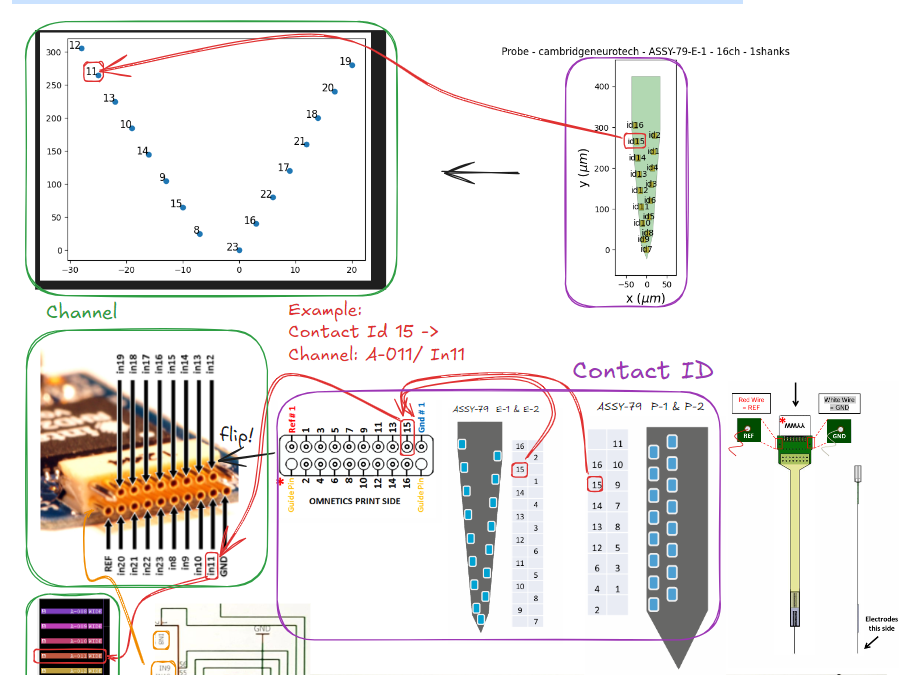
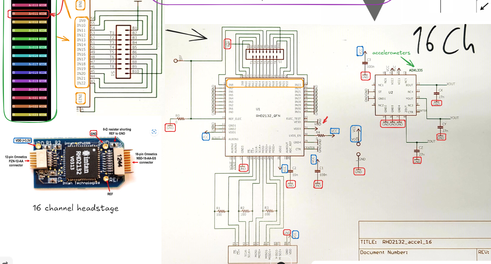
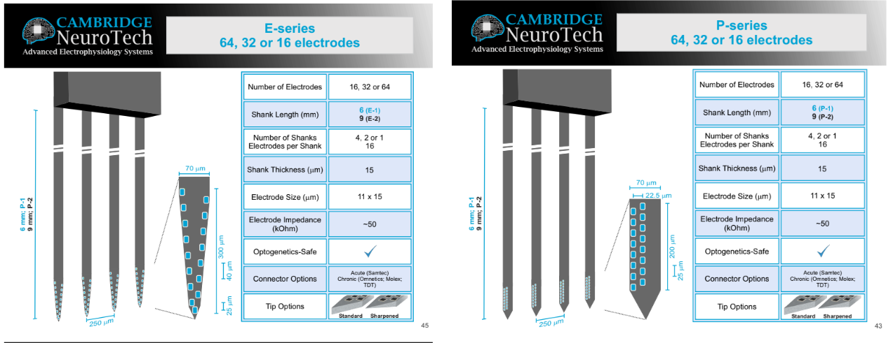

 title=2025-02-27 Intan headstage, electrodes & channel maps.md layout: default 
mathjax: true
tags: #project
---
Tags:  
- 📚 ADXL355 accelerometer: [Accelerometer Calibration](https://intantech.com/files/Intan_RHD2000_accelerometer_calibration.pdf) & [ADXL354/ADXL355 (Rev. A)](https://www.analog.com/media/en/technical-documentation/data-sheets/adxl354_355.pdf) 
- 📚 RHD 2132: https://intantech.com/files/Intan_RHD2000_series_datasheet.pdf
- 📚 Cambridge Neurotech dimensions: [Cambridge NeuroTech Product Catalog | PDF](https://www.scribd.com/document/771039846/Cambridge-NeuroTech-Product-Catalog)

| Name              | Num channels | Company             | Manual                                                                                             |
| ----------------- | ------------ | ------------------- | -------------------------------------------------------------------------------------------------- |
| ASSY-79 E-1 & E-2 | 16           | Cambridge Neurotech | [ASSY-79-E-1-E-2-map.pdf](https://www.cambridgeneurotech.com/assets/files/ASSY-79-E-1-E-2-map.pdf) |
| ASSY-79 P-1 & P-2 | 16           | Cambridge Neurotech | [ASSY-79-P-1-P-2-map.pdf](https://www.cambridgeneurotech.com/assets/files/ASSY-79-P-1-P-2-map.pdf) |






<br>
- ⚠️ P-1 & P-2/E-1 & E-2 $$\rightarrow$$ have the same contact ID configuration in terms of how they are organized above "omnetics print side" (electrode plugs)

| ASSY-79 P-1 & P-2/E-1 & E-2 (contact ID) | Channelmap (inXX/A-0XX) |
| ---------------------------------------- | ----------------------- |
| 1                                        | in20                    |
| 2                                        | in19                    |
| 3                                        | in21                    |
| 4                                        | in18                    |
| 5                                        | in22                    |
| 6                                        | in17                    |
| 7                                        | in23                    |
| 8                                        | in16                    |
| 9                                        | in8                     |
| 10                                       | in15                    |
| 11                                       | in9<br>                 |
| 12                                       | in14                    |
| 13                                       | in10                    |
| 14                                       | in13                    |
| 15                                       | in11                    |
| 16                                       | in12                    |


- ⚠️ Channelmap column (if contact ID col sorted from 1-16) $$\rightarrow$$ 
```python
# ASSY-79 P-1 & P-2/E-1 & E-2
chanMap = np.array([20, 19, 21, 18, 22, 17, 23, 16, 8, 15, 9, 14, 10, 13, 11, 12])
```




