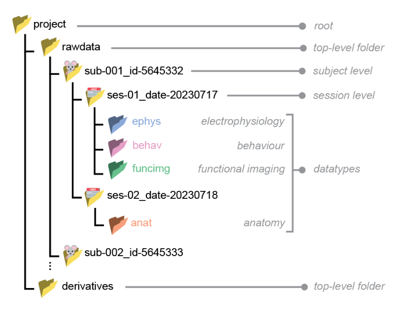
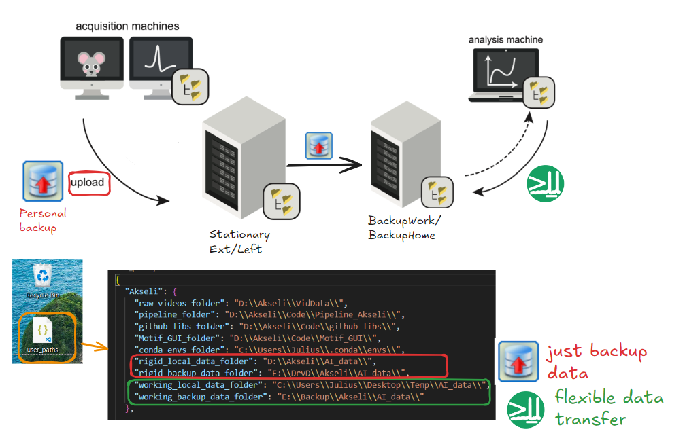
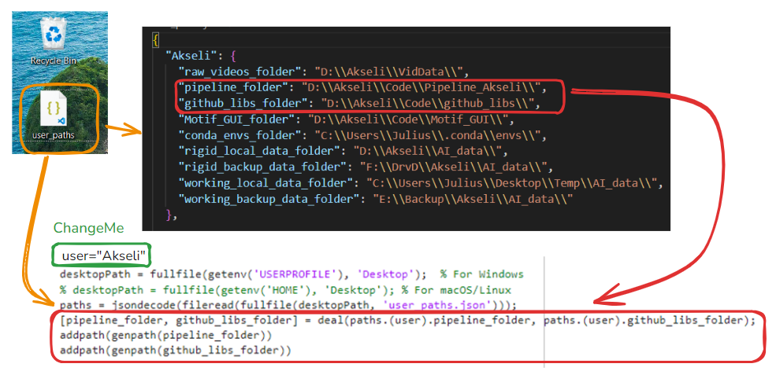

<br>
## Folder structure

In the lab, we adhere to this folder structure as it provides a neat sub-division between raw data and derived data (e.g. analysis). This has a coupe of advantages, e.g it makes sure that raw data does not get corrupted. You can read more about the **NeuroBlueprint** here: https://neuroblueprint.neuroinformatics.dev/latest/index.html.


<br>
## Data backup and file transfer

The **NeuroBlueprint** file structure can also be managed via the python library `datashuttle` (see more here https://datashuttle.neuroinformatics.dev/.)


Our data backup & file transfer consist of three parts:

1) Use `datashuttle` to create folder structure for individual session (see ``pipeline/functions/file_utils/datashuttle_utils.py``)

2) Use [Personal-Backup](https://personal-backup.rathlev-home.de/) to backup files from acquisition machine to 'Stationary' hard drives, and then from there to 'Backup Work/Home' hard drives

3) Once files are in 'Backup Work/Home', you can manually copy folders to analysis machines or use `datashuttle` functions to do so 


<br>

Given that file paths will differ across devices, you have to specify them for each machine separately in `Desktop/user_paths.json`. You can specify the following locations:


- ❌ Unless for a good reason, the file locations of **rigid folders** should not change:
- `rigid_local_data_folder` $$\rightarrow$$ file path where raw data will first be stored on acquisition machine
- `rigid_backup_data_folder` $$\rightarrow$$ file path where raw data will first be backed-up (Stationary Ext/Left)


- ✅ **Working folders** can be changed more dynamically depending on from where/how you would like to analyze the data:
- For example, if you want to work directly with the data from your remote BackupWork/BackupHome hard drive, it is enough to specify the `working_backup_data_folder`.  
- Alternatively, you can also use `dattashuttle` functions to download the data to a temporary `working_local_data_folder`, and then work with the data locally.
- For this see functions in ``pipeline/functions/file_utils/datashuttle_utils.py``  

<br>
## New user/new bird

If new experiments join the project, we need to:
- Add the user to `Desktop/user_paths.json`
- Add new datashuttle project in `pipeline/functions/file_utils/new_user_datashuttle.ipynb`
- Adjust if statements ``pipeline/functions/file_utils/datashuttle_utils.py``
- Set-up scripts in Personal backup.


If a new bird joins the project, we need to
- Adjust if statemetns in ``pipeline/functions/file_utils/datashuttle_utils.py``
- Adjust if statements in ``pipeline/functions/file_utils/get_session_path.m``

<br>
## Matlab AddPath


<br>

In the `Desktop/user_paths.json` file, you can also specify the locations of your code. If you add the following lines of code to your script. This will add all the functions in those folders and sub-directories to your Matlab path.

```matlab
user = 'Akseli'; % CHANGE


desktopPath = fullfile(getenv('USERPROFILE'), 'Desktop');  % For Windows
% desktopPath = fullfile(getenv('HOME'), 'Desktop'); % For macOS/Linux
paths = jsondecode(fileread(fullfile(desktopPath, 'user_paths.json')));
[pipeline_folder, github_libs_folder] = deal(paths.(user).pipeline_folder, paths.(user).github_libs_folder);
addpath(genpath(pipeline_folder)) 
addpath(genpath(github_libs_folder))
```


- ❌ Ideally, keep your `user` name consistent across `user_paths.json` consistent across machines, as this code is also used as input in some of our custom `datashuttle` functions for creating folders, transferring data.


<br>
## pipeline vs github_libs


| Type         | File location        | Description/ use-case                                                                                                                                                                                                                                                                                                                                         |
| ------------ | -------------------- | ------------------------------------------------------------------------------------------------------------------------------------------------------------------------------------------------------------------------------------------------------------------------------------------------------------------------------------------------------------- |
| our code     | `pipeline_folder`    | Put custom written functions here.                                                                                                                                                                                                                                                                                                                            |
| other's code | `github_libs_folder` | If you want to use other people's code, use `git clone` or [fork](https://docs.github.com/en/pull-requests/collaborating-with-pull-requests/working-with-forks/fork-a-repo) their repository from github to the `github_libs_folder`. If you specify `addpath(genpath(github_libs_folder))`, you can access all the functions from their code in your script. |


